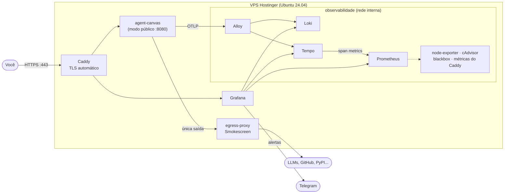

# openhands-infra

Infraestrutura como código para rodar o [OpenHands](https://github.com/OpenHands/OpenHands) (Agent Canvas) num VPS, com HTTPS automático, saída dos agentes controlada e observabilidade completa: métricas, logs, traces dos agentes e alertas no Telegram.

Tudo é versionado aqui. O servidor só recebe o estado renderizado (`rsync`) e os segredos decifrados em stream. Nada é configurado à mão.



## O que tem aqui

| Camada | Ferramenta | Por quê |
|---|---|---|
| Borda | **Caddy 2.11** | HTTPS com renovação automática, HTTP/3, headers de segurança, log JSON sem credenciais |
| App | **OpenHands Agent Canvas 1.24** (imagem oficial `ghcr.io/openhands/agent-canvas`) | Criação e orquestração de agentes |
| Saída | **Smokescreen** (Stripe) | Registra cada destino que os agentes acessam, bloqueia SSRF e pode virar allowlist |
| Métricas | **Prometheus 3.13 LTS** + node-exporter + cAdvisor + blackbox | Host, containers, disponibilidade externa, validade do TLS |
| Logs | **Loki 3.7** via **Alloy 1.20** | Containers, SSH, sudo, fail2ban, UFW |
| Traces | **Tempo 3.0** | Cada conversa dos agentes: chamadas de LLM, ferramentas, tokens, custo |
| Visualização e alertas | **Grafana 13.2** | 8 dashboards e 15 alertas provisionados por código, com envio ao Telegram |
| Backup | **offen/docker-volume-backup** | Cifrado com age, enviado para S3/B2 (opcional) |
| Host | **Ansible** | Usuário deploy, SSH endurecido, UFW, fail2ban, atualizações automáticas |
| Segredos | **SOPS + age** | Segredos cifrados dentro do git |
| Manutenção | **Renovate** + CI | PRs de atualização; toda config validada com as mesmas imagens do deploy |

## Pré-requisitos no seu computador

```bash
sudo apt install rsync jq
curl -LsSf https://astral.sh/uv/install.sh | sh     # uvx roda ansible e just sem instalar globalmente
uv tool install rust-just                            # comando `just`
uv tool install pre-commit
# sops e age: binários em https://github.com/getsops/sops/releases e https://github.com/FiloSottile/age/releases
```

Também: Docker (para `just validate`) e a chave SSH `~/.ssh/id_ed25519` que já acessa o servidor.

## Uso

```bash
just                 # lista todas as receitas
```

Primeiro deploy, passo a passo: **[docs/first-deploy.md](docs/first-deploy.md)**.

| Tarefa | Comando |
|---|---|
| Validar tudo (igual ao CI) | `just validate` |
| Ver drift do servidor | `just provision-check` |
| Aplicar config do host | `just provision` |
| Ver o que um deploy mudaria | `just diff` |
| Deploy | `just deploy` |
| Status, logs, restart | `just ps` · `just logs agent-canvas` · `just restart egress-proxy` |
| Chave de login do OpenHands | `just api-key` |
| Editar segredos | `just secrets-edit` |
| Auditoria de segurança do host | `just audit` |

## Estrutura

```
├── ansible/               # camada do host (SO)
├── stack/                 # tudo que vai para /opt/openhands no servidor
│   ├── compose.yaml       # a stack inteira
│   ├── caddy/             # Caddyfile
│   ├── egress/            # Smokescreen: Dockerfile, config, ACL de saída
│   └── observability/     # prometheus, loki, tempo, alloy, blackbox, grafana
├── secrets/               # só arquivos *.sops.env (cifrados)
├── scripts/               # deploy, validação, init de segredos
├── ci/dummy.env           # valores falsos para validar configs
└── docs/                  # arquitetura, runbooks, segurança, decisões
```

## Documentação

- [Arquitetura e redes](docs/architecture.md)
- [Primeiro deploy](docs/first-deploy.md)
- [Operação do dia a dia](docs/operations.md)
- [Modelo de segurança](docs/security.md), com **achados importantes sobre o OpenHands 1.24**
- [Decisões de arquitetura](docs/decisions.md)
